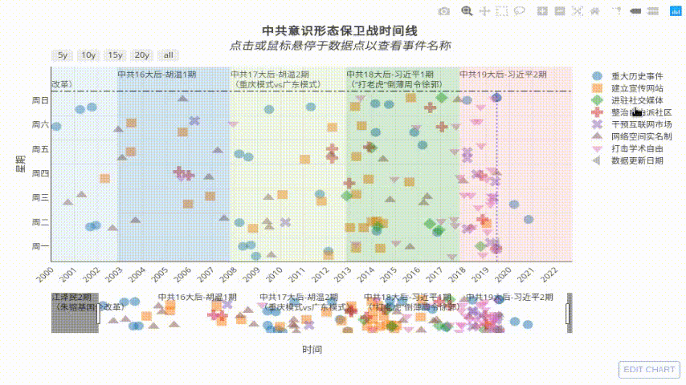

_查看图表请至本项目主页_
[https://github.com/chinatimeline/data/README.md](https://github.com/chinatimeline/data/README.md)

效果图

本项目跟踪：
- 进行中的[文革2.0](https://github.com/chinatimeline/data/README.md)
- 进行中的[中美贸易战](https://github.com/chinatimeline/data/README.md)
- 进行中的[一带一路](https://github.com/chinatimeline/data/README.md)

本项目旨在将中国的重大历史进程，如文革、六四天安门、改革开放等可视化。为读者展示一个纷繁复杂的历史过程，以更好地理解过去、预测未来。

[反馈和建议](https://github.com/chinatimeline/chinatimeline.github.io/issues)

推广软文：
1. [时代透镜：用时间线挖掘新闻背后的政治](https://matters.news/@chinatimeline/%E6%97%B6%E4%BB%A3%E9%80%8F%E9%95%9C-%E7%94%A8%E6%97%B6%E9%97%B4%E7%BA%BF%E6%8C%96%E6%8E%98%E6%96%B0%E9%97%BB%E8%83%8C%E5%90%8E%E7%9A%84%E6%94%BF%E6%B2%BB-zdpuAofz2CCLBQqoijirnM44gZJQWqVLmHYtQ43HTUS7MKe2c), [便于墙内传播的IPFS版](https://ipfs.io/ipfs/Qme1dxUWXVCbGgPD42g2z6BvfvuGvCZ2doKWHenqWPWd5v/), [本地](./IdeologyAnalysis.md)
2. [中国大陆迫害宗教自由时间线（数据来源：陆委会）](https://matters.news/@chinatimeline/%E4%B8%AD%E5%9B%BD%E5%A4%A7%E9%99%86%E8%BF%AB%E5%AE%B3%E5%AE%97%E6%95%99%E8%87%AA%E7%94%B1%E6%97%B6%E9%97%B4%E7%BA%BF-%E6%95%B0%E6%8D%AE%E6%9D%A5%E6%BA%90-%E9%99%86%E5%A7%94%E4%BC%9A-zdpuAoDuXD63izVe4PhCshhiQTyx5kKpHrG5VgZYFuTyureAR), [便于墙内传播的IPFS版](https://ipfs.io/ipfs/QmS1mgDSBG1MXaAV46HYPB5UMRLg6bjuNknTKY4QmmapHz)
2. [从402说开去——大事件时间线的广度与深度](https://matters.news/@chinatimeline/%E4%BB%8E402%E8%AF%B4%E5%BC%80%E5%8E%BB-%E5%A4%A7%E4%BA%8B%E4%BB%B6%E6%97%B6%E9%97%B4%E7%BA%BF%E7%9A%84%E5%B9%BF%E5%BA%A6%E4%B8%8E%E6%B7%B1%E5%BA%A6-zdpuAyscMtPkxfpX8DC1CLBmHu3WXXQ98imwz62U2sYMAbui6), [便于墙内传播的IPFS版](https://ipfs.io/ipfs/QmZWDJN8sNdfbbupXV5MGJrpLSafXmqdxp7KgPqv4cB6D6/)

2019-12-21
